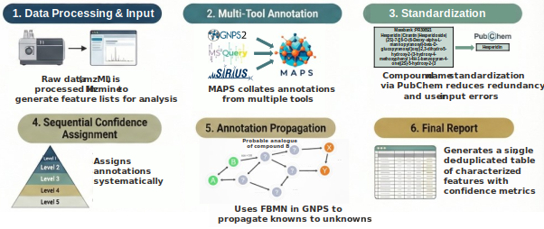

# MAPS: Metabolomics Annotation Propagation and Synthesis

**MAPS** is an R-based pipeline and Shiny application designed to integrate and standardize metabolomics annotation data. It streamlines the workflow between raw data processing (MZmine) and advanced annotation tools (GNPS2, MS2Query, SIRIUS), providing a unified interface for compound identification and visualization.

**

*Figure 1: The MAPS data-processing pipeline.*

---

### Citation

If you use MAPS in your work, please cite:

> [Insert Citation Here]

---

## Table of Contents

* [Prerequisites](https://www.google.com/search?q=%23prerequisites)
* [Step 1: Data Pre-processing (MZmine)](https://www.google.com/search?q=%23step-1-data-pre-processing-mzmine)
* [Step 2: External Annotation Tools](https://www.google.com/search?q=%23step-2-external-annotation-tools)
* [Step 3: Directory Structure](https://www.google.com/search?q=%23step-3-directory-structure)
* [Step 4: Running the MAPS App](https://www.google.com/search?q=%23step-4-running-the-maps-app)
* [Step 5: Outputs & File Reference](https://www.google.com/search?q=%23step-5-outputs--file-reference)
* [Glossary of Tools](https://www.google.com/search?q=%23glossary-of-tools)

---

## Prerequisites

Before running the MAPS pipeline, ensure the following tools are installed:

* **[ProteoWizard MSConvert](http://proteowizard.sourceforge.net/):** For converting raw vendor formats to `.mzML`.
* **[MZmine](http://mzmine.github.io/) (v4.5+):** For alignment and feature extraction.
* **[SIRIUS 6](https://www.google.com/search?q=https://sirius-ms.github.io/):** For formula and structure identification.
* **MS2Query:** Python-based tool for spectral library searching.Note: This must be installed and run via an Anaconda prompt (Python 3.7+ environment recommended).
* **R (v4.0+):** Required to run the Shiny application.

---

## Step 1: Data Pre-processing (MZmine)

### 1. Data Conversion

Convert all raw mass spectrometry data to the non-proprietary **.mzML** format using ProteoWizard MSConvert.

### 2. Processing & Alignment

Import the `.mzML` files into MZmine (v4.5 or later).

**Recommended Batch Processing:**
We provide a recommended MZmine batch file (available in this repository) that performs a cascading annotation strategy:

1. **Level 1 Assignments (5 Rounds):** * Starts with the highest stringency (High-Res m/z + RT Match + Spectral Match ≥ 6 fragments).
* Decreases in stringency sequentially to High-Res m/z + RT Match only (using Local Compound Database Search).
* *Note:* Assigned features are removed from the pool after each round to prevent duplicate matching.


2. **Level 2 Assignment:** * Checks for spectral matches (≥ 6 fragments) *without* retention time matching.
* This accounts for RT drift where strict alignment might fail.


### 3. MZmine Output

After processing, export the following three files. **Do not rename these files** (except for the folder path).

| File Name | MZmine Function |
| --- | --- |
| `ms1-and-ms2.csv` | **Export to CSV file (modular)** |
| `DATA_iimn_gnps_quant.csv` | **Export molecular networking files** (e.g., GNPS, FBMN, IIMN) |
| `data_annotations.csv` | **Export all annotations to CSV file** (Must be generated even if no Level 1 assignments exist) |

---

## Step 2: External Annotation Tools

Run the processed data through the following tools and generate the required output files.

### GNPS2

* **Requirement:** The MAPS pipeline requires **GNPS2** (incompatible with the original GNPS due to output differences).
* **FBMN:** Run feature-based molecular networking according to your desired paramaters. Set Top-K = 100 under "Library Search parameters".
* **Cytoscape Export:** Import the resulting `.graphml` file into Cytoscape and export the network table as a CSV.
* *Required File:* `cytoscape.csv`


* **Automatic Downloads:** MAPS will automatically retrieve `merged_results_with_gnps.tsv`, `clustersummary_with_network.tsv`, and `filtered_pairs.tsv` using your GNPS2 Task ID.

### MS2Query

* Run the MS2Query application via your Anaconda prompt. See https://github.com/iomega/ms2query for details.
* *Required File:* `ms2query.csv` (Case-sensitive).

### SIRIUS 6

* Run the "Write/Export Summary.tsv" function **twice**:
1. **Standard Run:** Default settings.
2. **Summaries ‘Write/Export Summary.tsv’** - Save results twice: first with the default parameters, and again setting K=100.

* *Required Files:*
* `canopus_structure_summary.tsv`
* `formula_identifications.tsv`
* `structure_identifications_top-100.tsv`


---

## Step 3: Directory Structure

To run the MAPS script successfully, organize your results into the following folder structure exactly as shown.

> **Note:** Folder and file names are **case-sensitive**.

```text
Processed_Data_Folder/
├── mzmine/
│   ├── ms1-and-ms2.csv
│   ├── DATA_iimn_gnps_quant.csv
│   └── data_annotations.csv
├── gnps/
│   └── cytoscape.csv
├── ms2query/
│   └── ms2query.csv
└── sirius/
    ├── canopus_structure_summary.tsv
    ├── formula_identifications.tsv
    └── structure_identifications_top-100.tsv

```

---

## Step 4: Running the MAPS App

1. Open `MAPS-app.R` in RStudio.
2. Install any missing libraries prompted by R.
3. Run the Shiny App.

### Configuration Fields

#### Mandatory Settings

* **Dataset ID:** An arbitrary name for your project/dataset.
* **Processed data folder:** The full path to the parent folder created in [Step 3](https://www.google.com/search?q=%23step-3-directory-structure) (use forward slashes `/`).
* **GNPS task ID:** The 32-character alphanumeric string from your GNPS2 URL (e.g., found after `task=` in the URL).
* **PubChem SQLite path:** Path to the local PubChem SQLite database (files and instructions provided in this repo).
* *If standardization is not required:* Deselect "PubChem standardization" and leave the path as default `""`.


#### Acceptance Thresholds

Adjust these based on your instrumentation resolution. Default values are optimized for a **Q Exactive Plus (Orbitrap)** with ~5% FDR.

* **Probability Scores:** Defaults: `gnps = 0.7`, `canopus = 0.7`, `csi = 0.64`, `ms2query = 0.7`.
* **RT Tolerance:** Default `0.1 min` (Creates a 0.2 min window). Adjust based on chromatography sharpness.
* **PPM Tolerance:** Default `5 ppm`.

#### Optional Features

* **Generate & save plots:** Generates basic visualizations comparing annotation counts and compound classes.
* **PubChem standardization:** Highly recommended. Standardizes names to PubChem entries to reduce redundancy across different tools.
* **Sublevel prioritizations:** Enable if using the detailed Level 1/2 subclass matching from the provided MZmine batch.

---

## Step 5: Outputs & File Reference

This section details the primary output files generated by MAPS and defines the confidence levels used in the annotation process.

### Annotation Confidence Levels

MAPS assigns confidence levels based on the strength of the match:

* **Level 1:** Authentic Standard (requires MS/MS and retention time match).
* **Level 2:** MS/MS spectral library match.
* **Level 3:** Analogue to a Level 1 or 2 compound, or an *in silico* match.
* **Level 4:** Compound Class assignment.
* **Level 5:** Formula or HRMS (High-Resolution Mass Spectrometry) only.

### Primary Output: `final-annotation-df.csv`

This file is the comprehensive list of annotations (without intensity data). It represents the primary MAPS output, containing the highest-confidence annotation per feature, standardized to PubChem where applicable.

| Column | Description |
| --- | --- |
| **feature.ID** | Most intense ion for a particular compound (related ions matched by IIN). |
| **rt** | Retention time in minutes. |
| **mz** | Mass to charge ratio (). |
| **compound.name** | Highest confidence annotation as determined by MAPS (standardised to PubChem). |
| **smiles** | Computational interpretation of molecule (standardised to PubChem). |
| **annotation.type** | Annotation tool from which the annotation was derived. |
| **confidence.level** | Annotation confidence level (1-5). |
| **confidence.score** | Score derived from the specific tool (non-probabilistic). Accepted thresholds: GNPS cosine > 0.7; CANOPUS > 0.7; CSI:FingerID > 0.64; MS2Query Tanimoto > 0.63. |
| **id.prob** | Identification probability computed as  (Dorrestein, 2025). |
| **CID** | Identifiers for PubChem. |
| **HMDB.ID** | Identifiers for Human Metabolome Database. |
| **Formula** | Molecular formula for unionised species. |
| **IUPAC** | IUPAC compound name. |
| **Monoisotopic.Mass** | Monoisotopic mass of the compound. |
| **mz.diff.ppm** | Difference between observed and theoretical mass (in ppm). |
| **feature.usi** | Universal spectrum identifier for the feature. |
| **gnps.library.usi** | Unique spectrum identifier to matched library spectrum in GNPS2. |
| **gnps.cluster.ID** | Feature-based molecular networking cluster ID. |
| **gnps.in.silico.bile.acid.info** | Bile acid info (only applicable to level 3 annotations from GNPS *in silico* libraries). |
| **canopus.NPC.pathway** | NPClassifier pathway from CANOPUS. |
| **canopus.NPC.pathway.probability** | NPClassifier pathway probabilities from CANOPUS. |
| **canopus.NPC.superclass** | NPClassifier superclass from CANOPUS. |
| **canopus.NPC.superclass.probability** | NPClassifier superclass probabilities from CANOPUS. |
| **canopus.classyfire.subclass** | ClassyFire subclass from CANOPUS. |
| **canopus.classyfire.subclass.probability** | ClassyFire subclass probabilities from CANOPUS. |
| **canopus.classyfire.specclass** | ClassyFire specific class from CANOPUS. |
| **canopus.classyfire.sspecclass.probability** | ClassyFire specific class probabilities from CANOPUS. |
| **zodiac.formula** | Formula predicted by ZODIAC. |
| **zodiac.confidence.score** | Confidence score for formula predicted by ZODIAC. |
| **Propagated.Feature.ID** | Feature ID, type, and class if the annotation was propagated from a cluster member. |
| **Propagated.Annotation.Type** | Feature ID of the known propagated annotation. |
| **Propagated.Annotation.Class** | canopus.NPC.superclass of the known propagated annotation. |
| **Samples** | List of samples in which the feature is detected. |

### Abundance Output: `samples-df.csv`

A matrix of samples and feature abundances (area under the curve). It shares identification columns (ID, USI, name, SMILES, Formula, IUPAC, Mass) with the annotation file for easy merging.

| Column | Description |
| --- | --- |
| **samples** | One row per sample, regardless of feature presence. |
| **area** | Area under the curve (AUC) for the feature in that sample. |

### Supplementary Files

The pipeline involves several other key files, categorized below:

**Analysis & Summaries:**

* `top-10-features.csv`: Top 10 most abundant features in the dataset.
* `DATASET.ID-counts.csv`: Number of features annotated at each confidence level.
* `cytoscape-v2.csv`: Annotation override file formatted for Cytoscape network visualization.

**Intermediate & Source Data:**

* `ms1-and-ms2.csv`: Comprehensive MS1 and MS2 feature table (Input).
* `DATA_iimn_gnps.mgf`: MS2 spectra for GNPS and MS2Query.
* `data_sirius.mgf`: MS1 and MS2 spectra for SIRIUS.
* `mzmine-batch.mzbatch`: The MZmine processing workflow file.
* `canopus_formula_summary.tsv`: CANOPUS class predictions from formulae.

---

## Glossary of Tools

| Tool | Description |
| --- | --- |
| **MAPS** | *Metabolite Annotation Propagation and Synthesis:* Automated pipeline for processed untargeted metabolomics data (Michael Cowled, Metabolomics Australia, University of Melbourne). |
| **Propagation Tool** | Propagates level 1–2 annotations to clustered unknown analogues. |
| **Ion Identity Networking (IIN)** | Links adducts of the same compound within MZmine. |
| **MZmine** | Open-source MS data processing and QC software. |
| **GNPS** | Global Natural Product Social Molecular Networking platform. |
| **FBMN** | Feature-Based Molecular Networking. |
| **CANOPUS** | Compound class prediction via SIRIUS. |
| **CSI:FingerID** | *In silico* structure identification. |
| **ZODIAC** | Molecular formula prediction. |
| **MS2Query** | Spectral library search and analogue prediction. |
| **Cytoscape** | Network visualisation tool. |
